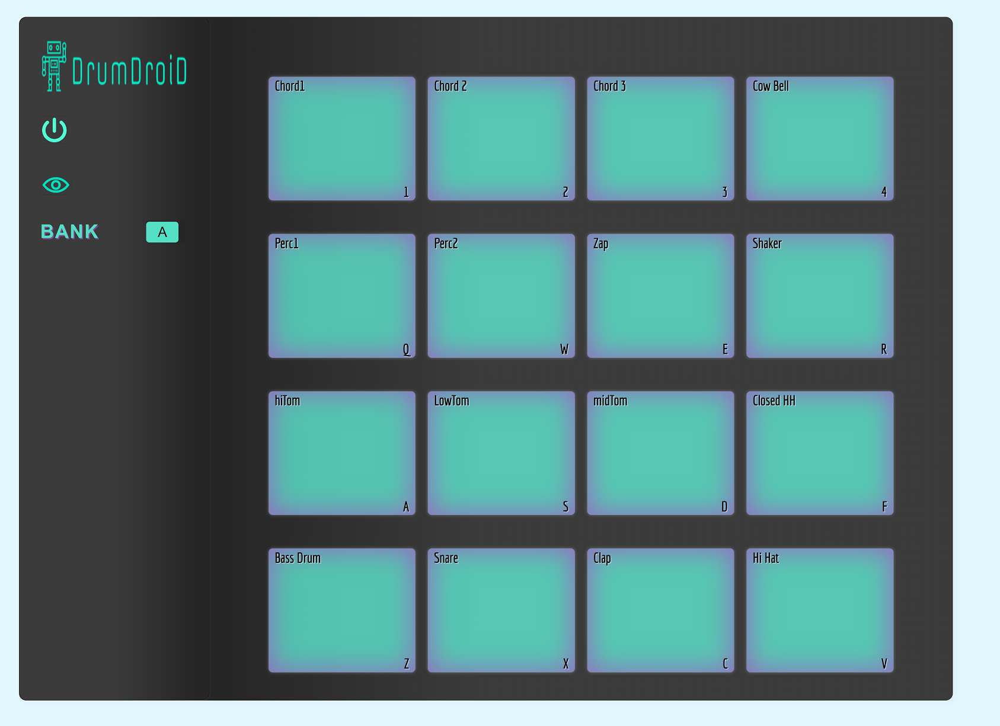

# Drum-Machine

This is a Drum Machine which plays samples. It Has two banks.

## Technologies Used

---

Made with Javascript, HTML, CSS and React.

## About the project

---

Originally something I started around two years ago. For personal reasons, I had stopped programming and left the app unfinished. I am coding again, and I've always wanted to finish this app. 

I had forgotten how I coded the app, so I had to relearn my code. That part was probably the biggest challenge. I have learned a lot since starting this app and now. If I could do this all over, I would not overcomplicate some things in this app. For instance, the amount of nested componants. 

Completing this app was a good learning experience, I am glad I finished it. 🐱‍💻
